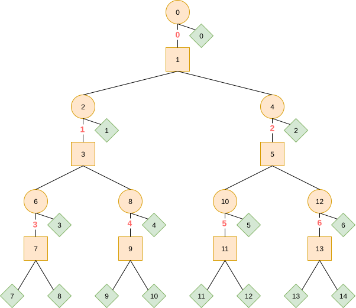

> **Note**
> This is in an early stage and currently only tested against one example model - please validate the resulting ONNX models

# Example usage
Either via command line tool `fastbdt2onnx`, e.g. using [uvx](https://docs.astral.sh/uv/concepts/tools/#the-uv-tool-interface):

```bash
uvx git+https://github.com/nikoladze/fastbdt2onnx <fastbdt-txt-file> <onnx-model-file>
```

Or via the python API:

```bash
pip install git+https://github.com/nikoladze/fastbdt2onnx
```

```python
import onnx
from fastbdt2onnx import convert
model_proto = convert(fastbdt_textfile)
onnx.save(model_proto, onnx_outputfile)
```

# Development Setup (only needed for tests)

``` bash
git submodule init
git submodule update
cd FastBDT
cmake .
make

cd ..
uv sync
```

# Run tests

``` bash
uv run --group test pytest tests.py
```

# How does it work?

Using the [ONNX TreeEnsemble operation](https://onnx.ai/onnx/operators/onnx_aionnxml_TreeEnsemble.html) we need to specify for every node in the whole forest of trees

- if the false/true brach is a leaf, `nodes_{false,true}leafs`
- the leaf or node index of the false/true branch, `nodes_{false,true}nodeids`
- the feaure id of every node, `nodes_featureids`
- the splitting value of every node, `nodes_splits`
- the index of the tree roots since all nodes are in one global list, `tree_roots`

The starting value `f0` in FastBDT is added to all weights of the first tree. In the end we apply the logistic transformation as a separate node in the ONNX graph. FastBDT uses a factor of 2 in the definition of the logistic function, which we factor into the leaf weights. 

Up to this point the conversion is rather straightforward, but FastBDT has a special handling of NaN inputs: if a NaN value is encountered, the tree traversion is stopped and a specific output value for that node is returned.

Special handling of NaN values in the `TreeEnsemble` node is supported via the `nodes_missing_value_tracks_true` attribute. With that we can specify that NaN values go to the `true` branch - together with choosing NaN as a splitting value we can build nodes that go to `false` for every non-NaN value. So we duplicate all nodes, starting with one node that first distinguishes between NaN values (directly go to a leaf) and non-NaN values (go to the actual node):



The red indices in the graphic represent the original (0-based) node indices. The orange circles represent the NaN-nodes (go to leaf if NaN input), the orange squares the normal nodes and the green squares the leafs.
